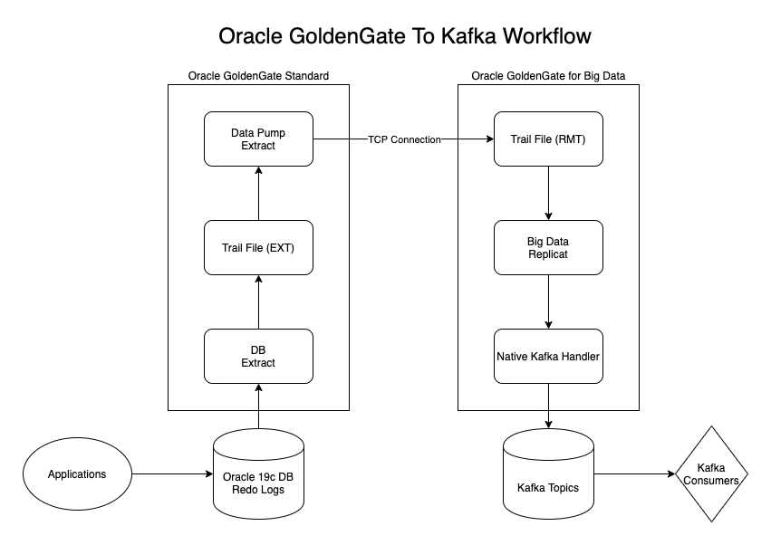

# Oracle GoldenGate for Big Data Example Using Kafka

## Prerequisites
This example assumes running in the docker-desktop exposed Kubernetes (single node cluster) using host path mounted values.  The paths are currently hard-coded and need to be adjusted by hand.

### Oracle Images
Each image associated needs to be built by hand using the Oracle guides for building images.  The Oracle GoldenGate images require downloading two separate Oracle GoldenGate versions, Oracle GoldenGate Standard and Oracle GoldenGate for Big Data.  These have different versions associated with them and will be separate images.

[Oracle Database 19c Image](https://github.com/oracle/docker-images/tree/master/OracleDatabase/SingleInstance)

[Oracle Goldengate 19.X Images](https://github.com/oracle/docker-images/tree/master/OracleGoldenGate)

### Kafka libraries
This example uses the [Strimzi Kafka Operator](https://strimzi.io/downloads/).  The libraries associated with the version of Kafka are extracted from the Strimzi release and placed in the `/opt/kafka/libs` folder.

## Architecture

## Basic Setup Steps

1. Get Oracle Database to save archive logs and have  compatible settings with Oracle GoldenGate Standard.
2. Connect Oracle GoldenGate Standard to Oracle Database via `EXTRACT`.  Extracts write a trail file.
3. Connect Oracle GoldenGate Standard to Oracle GoldenGate for Big Data via a Data Pump Extract.  Data pumps write info from a local trail file (`EXTTRAIL`) to a remote trail file (`RMTTRAIL`).
4. Configure an Oracle `REPLICAT` to read data from the trail file and write to the Oracle GoldenGate for Big Data Java Handler.  The Java handler then routes (via configuration in the [kafka.props](goldengate-bigdata-prms/kafka.props) file) to the Kafka handler.
5. Kafka handler then publishes the `REPLICAT` data to JSON in Kafka Topics (one topic per table) to the kafka server configuration defined in [custom_kafka_producer.properties](goldengate-bigdata-prms/custom_kafka_producer.properties).